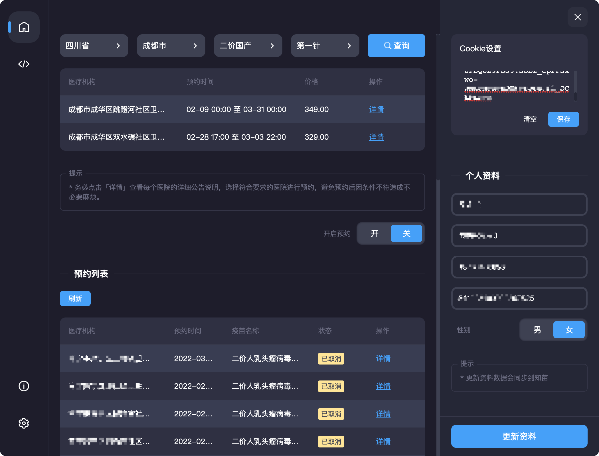
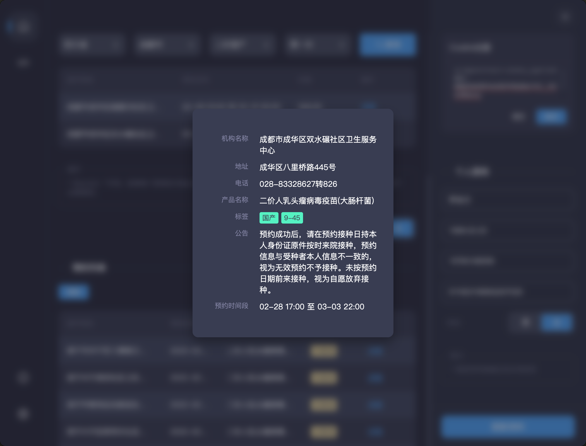
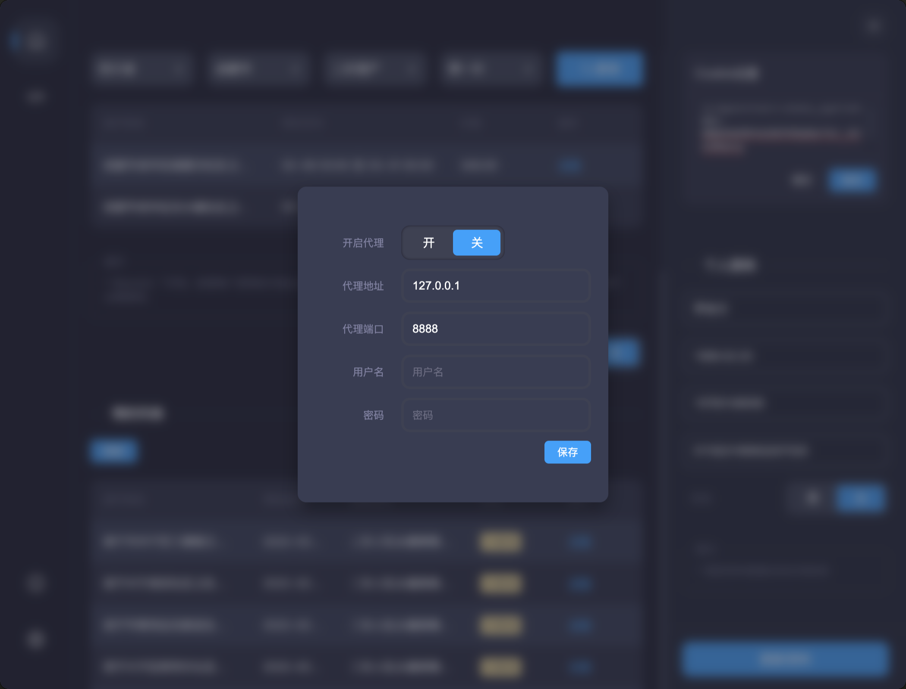
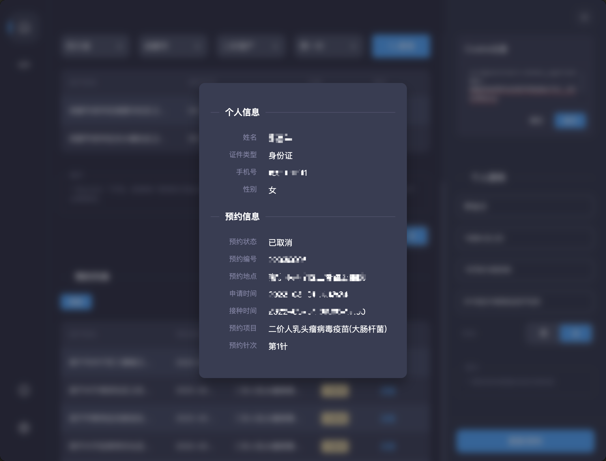

# 知苗易约小助手

> 基于electron开发的知苗易约助手

一直想体验下electron，所以花了三四天时间照着文档撸了个工具，本想结合vue但是对electron不熟悉，最后放弃，使用传统工艺打造，没有使用任何ui组件。

> 注：仅供学习交流，切勿用于任何商业用途

## 实现的功能
1. 查询指定地区可预约的机构列表
2. 修改个人资料
3. 个人预约列表查看及取消操作
4. 设置系统代理功能
5. 预约功能不支持（暂时去掉）

## 界面截图
> 
> 
> 
> 

## 安装
下载本项目切换到项目目录

```js
// 使用yarn
yarn
yarn start

// 使用npm
npm install
npm start
```

## 使用方法

看界面操作即可，查询苗是不需要cookie的，个人信息和预约列表才需要